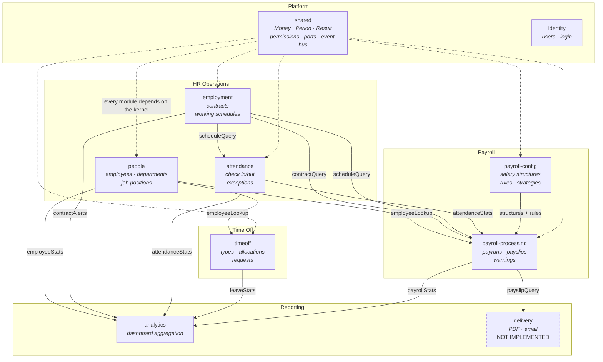
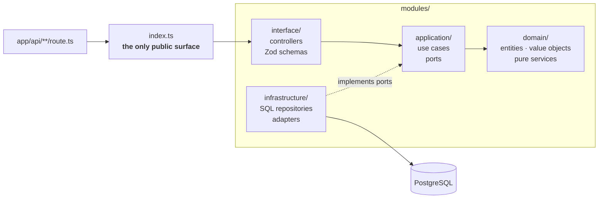
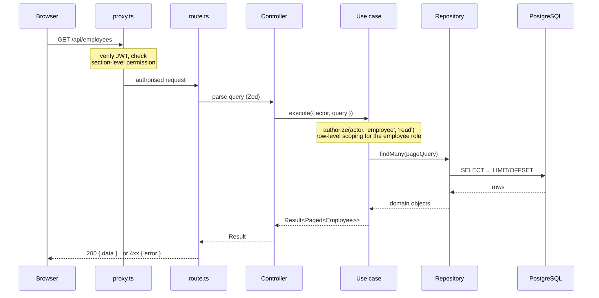
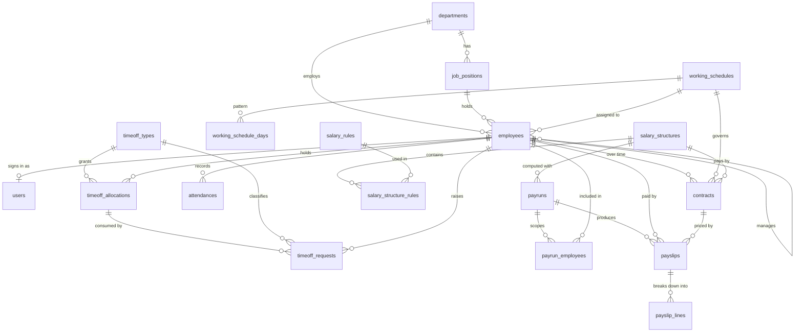
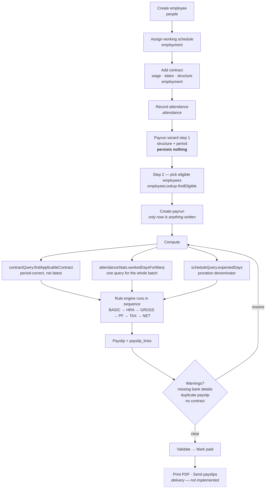
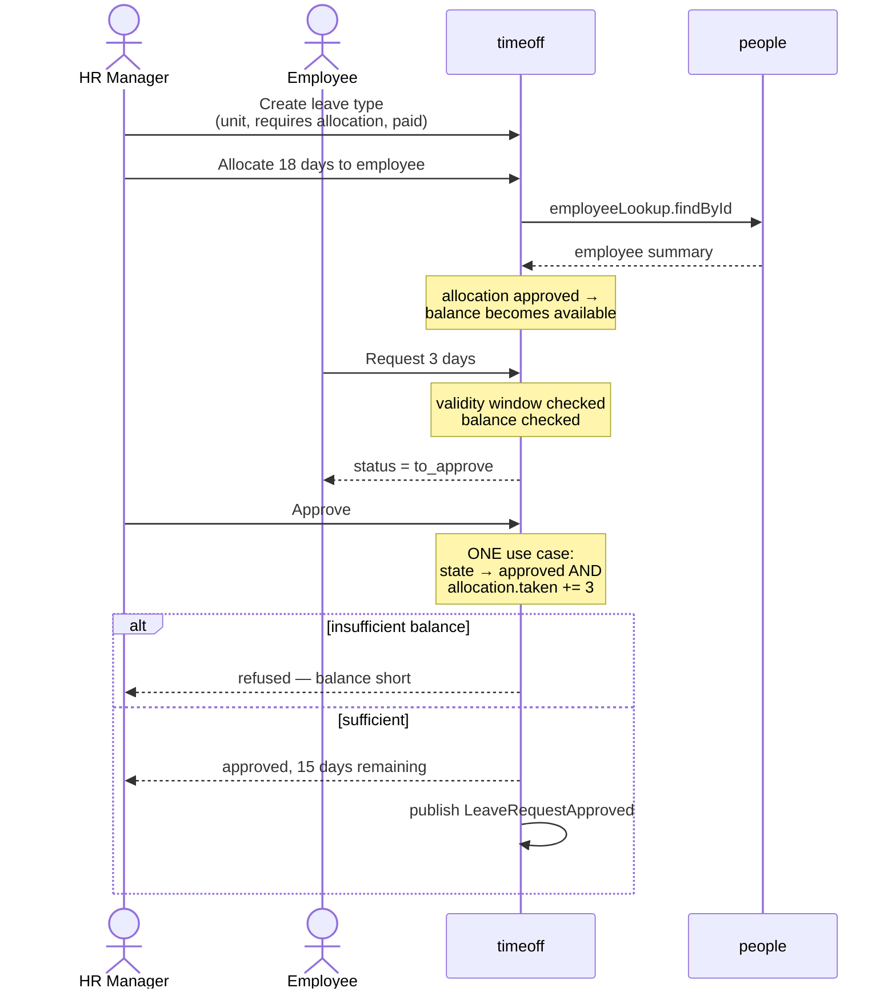
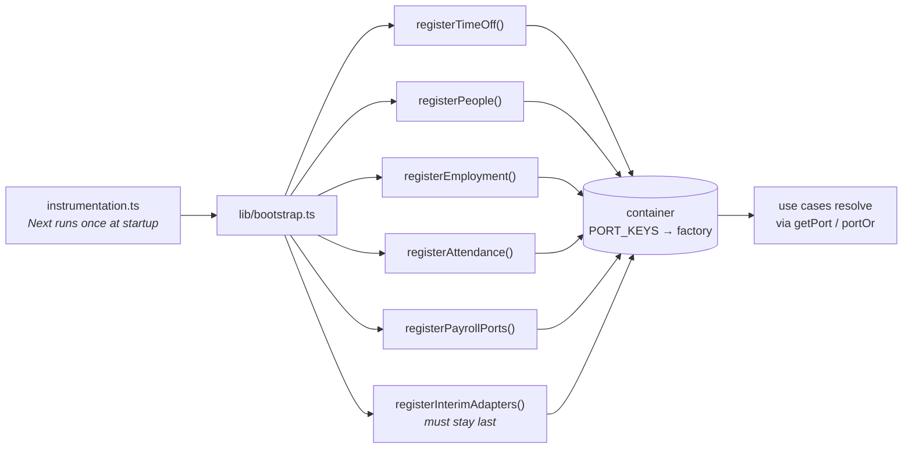

# PeoplePay360 — Architecture

Every diagram below is drawn from the code as it stands: module boundaries from
`modules/`, ports from `modules/shared/contracts/port-keys.ts`, tables from
`migrations/0001`–`0009`. If a diagram and the code disagree, the code is right
and this file is stale.

Diagrams are [Mermaid](https://mermaid.js.org/); GitHub renders them inline.

---

## 1. Bounded contexts and their dependencies

The system is a **modular monolith**: one deployable, ten bounded contexts, and
no context may reach into another's internals. Everything crossing a boundary
goes through a *port* — a TypeScript interface published in the shared kernel
and satisfied at runtime by whichever module owns the data.

Arrows read *"publishes a port consumed by"*. Payroll never imports
`employment`; it asks the container for `PORT_KEYS.contractQuery` and receives
whatever satisfies that interface. Swapping the implementation is one line in
`lib/bootstrap.ts`.

---

## 2. Anatomy of a module

Every context has the same four layers, and dependencies only ever point
inward. `domain` and `application` import no framework at all — that is what
lets 300 tests run with no database and no Next runtime.

Three rules, all enforced by ESLint rather than by convention:

| Rule | Enforced by |
| --- | --- |
| Module internals are private — import `@/modules/<x>`, never `@/modules/<x>/domain/...` | `no-restricted-imports`, per-module patterns |
| `domain/` and `application/` may not import `next/*`, `pg`, `react` or `@/lib/*` | `no-restricted-imports`, paths + patterns |
| Client components import `@/modules/<x>/schemas`, never the module barrel | the barrel reaches the SQL repositories; importing it from `'use client'` pulls the Postgres driver into the browser and fails the build |

---

## 3. Request lifecycle

A route handler is about five lines. It parses, calls one use case, and maps the
`Result` onto HTTP. All the business logic sits below it, where it can be tested
without a server.

Authorisation happens **twice on purpose**. `proxy.ts` answers "may this role
open this area at all", which is coarse and cheap. The use case answers "may
this actor touch *this row*", which the proxy cannot know because it has not
loaded the record. Hiding a button in the UI is a courtesy, never a control.

---

## 4. Data model

Eighteen application tables, plus a `schema_migrations` bookkeeping table the
migration runner maintains. UUID primary keys throughout, `numeric` for every
money column, `timestamptz` for every instant.

Three constraints carry business rules the application alone could not
guarantee:

| Constraint | Table | Why it exists |
| --- | --- | --- |
| `EXCLUDE USING gist (employee_id WITH =, daterange(starts_on, ends_on, '[]') WITH &&) WHERE status = 'active'` | `contracts` | The spec's "avoid concurrent active contracts". Two racing requests cannot both win; an application-level "does one exist?" check can never promise that. |
| `UNIQUE (employee_id, worked_on)` | `attendances` | One attendance record per person per day. |
| `UNIQUE (payrun_id, employee_id)` | `payslips` | An employee cannot be paid twice in one run. |

The `daterange` is inclusive at both ends (`'[]'`), matching the `Period` value
object exactly — so SQL and the domain agree on what "overlapping" means.

---

## 5. Scenario A — employee to payslip

The first of the two end-to-end walkthroughs. The step that matters is contract
resolution: payroll asks for the contract covering *the period being run*, not
the newest one.

Rules execute in `sequence` order and later rules reference earlier results by
code. Referencing a code that has not run yet is an **error**, not zero —
silently treating it as zero produces a wrong payslip that looks right, which is
the worst failure this system could have.

---

## 6. Scenario B — allocation to request

The second walkthrough. Approval and balance consumption happen in one use case,
so they cannot drift apart.

---

## 7. Composition root

Ports are declarations; something has to bind them. `instrumentation.ts` runs
once at server start and calls `lib/bootstrap.ts`, the single place that knows
every module exists.

`providePort` is **first-wins** and the interim adapters register **last**, so a
real implementation always beats scaffolding. That ordering is what let three
developers integrate continuously: a module that was not finished yet fell
through to a null object instead of breaking everyone else's build.

---

## 8. Design decisions worth defending

| Decision | Reasoning |
| --- | --- |
| **Modular monolith, not microservices** | One deploy, no network between contexts, but the boundaries are real and lint-enforced. A context could be extracted later; none needed to be during a 24-hour build. |
| **Hand-written SQL, no ORM** | The payroll aggregations (`COUNT(*) FILTER`, `GROUP BY` over date ranges, a `daterange` exclusion constraint) are exactly the queries ORMs obscure. |
| **`Money` as integer minor units** | A one-paise float drift across 500 payslips is unfindable. Rounding happens once, explicitly. |
| **Strategy + Registry for salary rules** | A new computation type is one class and one registry line; the engine never changes. Open/closed, applied where the requirements actually vary. |
| **Ports over direct imports** | Payroll and Time Off were built in parallel with the modules they depend on. Each side coded against an interface and integrated in minutes. |
| **Two-layer authorisation** | Coarse checks in the proxy, row-level checks in use cases. Neither layer can answer the other's question. |
| **Permissions as data** | One table drives the API guard, the route proxy and the navigation — the UI cannot offer what the API would refuse. |
