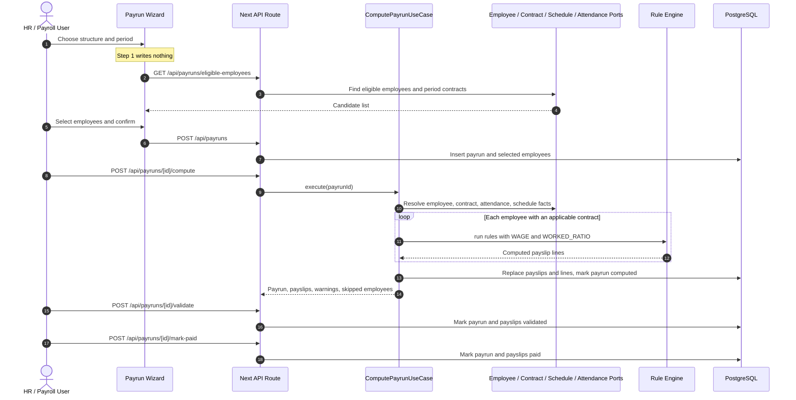

# Payroll Flow And Architecture

Prepared for Plan C review: `payroll-config` and `payroll-processing`.

## Core Points

1. The payroll domain engine is pure TypeScript. It does not import Next.js, React, `pg`, or app-level database helpers, so the rule engine and payrun lifecycle run in fast unit tests with no database.
2. Postgres is the persistence layer. Payroll repositories use explicit SQL through `lib/db.ts`, mapped back into domain objects in `infrastructure/`.
3. Salary rules support the computation types allowed by `migrations/0003_payroll_config.sql`: `fixed`, `percentage`, and `formula`.
4. Period-correct contract selection is preserved through `ContractQueryPort.findApplicableContract(employeeId, period)`. The resolved wage is passed into the engine as the reserved formula input `WAGE`.
5. Proration is explicit in formulas. A wage rule can be written as `WAGE * WORKED_RATIO`, where `WORKED_RATIO` is computed from attendance hours divided by scheduled expected hours.
6. User formulas are parsed by a whitelist parser, not `eval` or `new Function`.
7. Payruns move through a strict state machine: `draft -> computed -> validated -> paid`.
8. Before validation, payroll runs warning checks for missing contracts, duplicate payslips, missing bank details, and contracts expiring inside the period.

## Folder Shape

```text
modules/payroll-config/
  domain/             pure salary rules, structures, parser, and rule engine
  application/        use cases and repository/query ports
  infrastructure/     Postgres repositories and SQL row mappings
  interface/          HTTP controllers and zod schemas
  index.ts            client-safe public exports
  server.ts           server-only use cases, controllers, repositories

modules/payroll-processing/
  domain/             payrun, payslip, state machine, warning checks
  application/        create/compute/validate/mark-paid/list use cases
  infrastructure/     Postgres payrun/payslip repositories and read adapters
  interface/          HTTP controllers, schemas, and view mappers
  index.ts            client-safe public exports
  server.ts           server-only use cases, controllers, repositories
```

## End-To-End Flow



## Integration Ports

Payroll consumes these Dev B ports from `@/modules/shared`:

- `EmployeeLookupPort`
- `ContractQueryPort`
- `ScheduleQueryPort`
- `AttendanceStatsPort`

Payroll provides these Dev A ports:

- `PayslipQueryPort` for PDF generation and bulk email.
- `PayrollStatsPort` for dashboard totals, department cost, trends, and duplicate-payslip alerts.

## Verification

Current targeted payroll verification:

```bash
npx tsc --noEmit --incremental false
npx eslint modules/payroll-config modules/payroll-processing "app/(dashboard)/payroll" app/api/payroll app/api/payruns app/api/payslips
npx vitest run modules/payroll-config modules/payroll-processing
```

At the time of this update, targeted payroll tests pass: 10 files, 125 tests.
